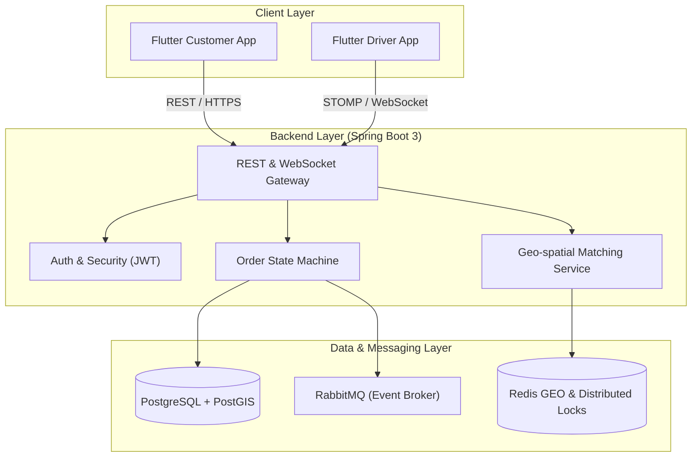

# 🚀 SwiftDrop – Real-Time On-Demand Logistics Platform

SwiftDrop là hệ thống điều phối và giao vận nội thành theo thời gian thực được xây dựng bằng kiến trúc Microservices/Modular Monolith với **Spring Boot 3** và ứng dụng di động đa nền tảng bằng **Flutter** (Clean Architecture + BLoC).

---

## 🏗 System Architecture



---

## 🛠 Tech Stack

* **Mobile App:** Flutter, Dart, BLoC Pattern, Drift (Offline Sync), Mapbox / Google Maps SDK.
* **Backend:** Java 17/21, Spring Boot 3, Spring Security, Spring WebSocket.
* **Databases & Cache:** PostgreSQL (PostGIS), Redis (Redis GEO, Redisson Lock).
* **Messaging:** RabbitMQ / Kafka.
* **DevOps:** Docker, Docker Compose, GitHub Actions.

---

## ⚡ Quick Start

### 1. Khởi động hạ tầng cơ sở dữ liệu & Message Queue
```bash
docker compose -f deployments/docker-compose.yml up -d
```

### 2. Chạy Backend (Spring Boot)
```bash
cd apps/backend
./mvnw spring-boot:run
```

### 3. Chạy Mobile App (Flutter)
```bash
cd apps/mobile
flutter pub get
flutter run
```