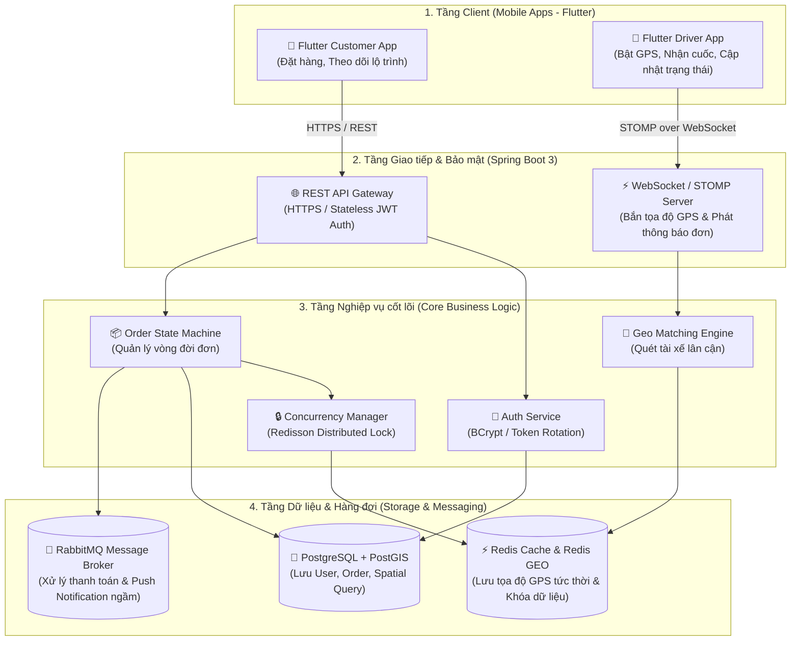
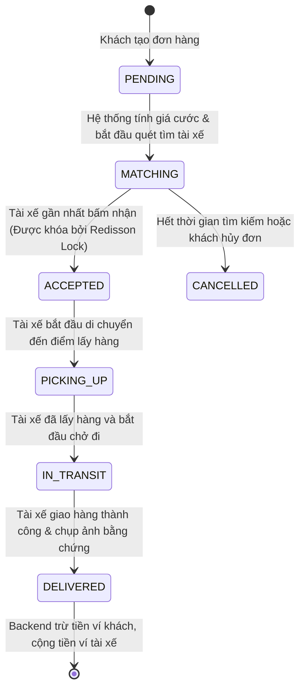

#  SwiftDrop – High-Level Architecture & Product Design

> **Tài liệu:** Bản thiết kế Kiến trúc Tổng quan (High-Level Design - HLD)  
> **Dự án:** SwiftDrop – Nền tảng Giao vận & Điều phối Nội thành Thời gian thực  
> **Tác giả:** Pham Viet Quang Huy  
> **Ngày tạo:** 2026-08-27  

---

## 1. Tuyên ngôn Sản phẩm & Bài toán Giải quyết (Product Vision)

SwiftDrop là nền tảng công nghệ kết nối giữa **Người gửi hàng (Customer)** và **Tài xế giao hàng (Driver)**:
* **Vấn đề giải quyết:** Tối ưu hóa thời gian giao hàng tức thì trong nội thành; tính cước tự động dựa trên khoảng cách; theo dõi hành trình trực tiếp của tài xế trên bản đồ.
* **Đối tượng phục vụ:**
  1. *Khách hàng (Customer):* Cần gửi đồ nhanh, theo dõi vị trí xe thời gian thực.
  2. *Tài xế (Driver):* Nhận đơn quanh khu vực đang đứng, nhận tiền cước tức thì vào ví.
  3. *Hệ thống (Backend Engine):* Tự động điều phối, ghép nối tài xế gần nhất trong bán kính 3km và chống tranh chấp đơn hàng.

---

## 2. Kiến trúc Hệ thống Tổng quan (System Architecture)

Hệ thống được thiết kế theo kiến trúc **Modular Monolith** phân tầng rõ ràng:



---

## 3. Vòng đời Trạng thái Vận đơn (Order State Machine)

Toàn bộ quy trình từ lúc khách bấm đặt đơn đến khi giao hàng thành công:



---

## 4. Lộ trình Triển khai Dự án (Engineering Roadmap)

* **Chặng 1: Xác thực & Quản lý Người dùng (Authentication & User Management)**
  * Thiết kế Entity `User`, bảng `users`, mã hóa mật khẩu `BCrypt`.
  * Cấp phát thẻ bài xác thực `JWT` (Access Token / Refresh Token).
* **Chặng 2: Quản lý Vận đơn & Tính cước (Order Management & Pricing Engine)**
  * Thiết kế bảng `orders`, tích hợp thuật toán tính khoảng cách (Haversine / PostGIS).
  * Xây dựng luồng chuyển đổi trạng thái đơn hàng theo State Machine.
* **Chặng 3: Không gian Địa lý & Thời gian thực (Real-time Geo Tracking)**
  * Tích hợp `Redis GEO` lưu vết tọa độ tài xế.
  * Tích hợp `WebSocket (STOMP)` phát đơn hàng tức thời.
  * Cài đặt `Redisson Distributed Lock` chống 2 tài xế nhận cùng 1 đơn.
  * Ứng dụng Flutter hiển thị Google Maps và vẽ xe di chuyển mượt mà.
* **Chặng 4: Tự động hóa Bất đồng bộ & Hoàn thiện (Async Events & Polish)**
  * Tích hợp `RabbitMQ` gửi thông báo đẩy (Push Notification) và xử lý ví tiền.
  * Cơ chế ngoại tuyến `Offline-First` cho app tài xế.v# 🚀 SwiftDrop – High-Level Architecture & Product Design

## Global ERD
``` mermaid
erDiagram
    users ||--o| driver_profiles : "1 - 1 (Một user tài xế có 1 hồ sơ)"
    users ||--o{ orders : "1 - N (Một khách hàng đặt nhiều đơn)"
    users ||--o| wallets : "1 - 1 (Mỗi user có 1 ví tiền)"
    
    orders ||--o{ order_status_history : "1 - N (Một đơn có nhiều lịch sử trạng thái)"
    wallets ||--o{ wallet_transactions : "1 - N (Một ví có nhiều giao dịch)"

    users {
        bigint id PK "Khóa chính"
        varchar email UK "Email duy nhất"
        varchar password "Mật khẩu băm"
        varchar full_name "Họ và tên"
        varchar phone_number "Số điện thoại"
        varchar role "ROLE_CUSTOMER / ROLE_DRIVER / ROLE_ADMIN"
        timestamptz created_at "Ngày tạo"
        timestamptz updated_at "Ngày cập nhật"
    }

    driver_profiles {
        bigint id PK "Khóa chính"
        bigint user_id FK,UK "Khóa ngoại trỏ sang users(id)"
        varchar vehicle_plate "Biển số xe"
        varchar vehicle_type "Loại xe (BIKE, CAR, VAN)"
        boolean is_online "Trạng thái trực tuyến nhận cuốc"
        decimal rating_average "Điểm đánh giá sao (1.0 - 5.0)"
        timestamptz updated_at "Ngày cập nhật"
    }

    orders {
        bigint id PK "Khóa chính"
        varchar order_code UK "Mã vận đơn (vd: 'SD-20260827-001')"
        bigint customer_id FK "Khóa ngoại: Người đặt đơn"
        bigint driver_id FK "Khóa ngoại: Tài xế nhận (có thể NULL)"
        text pickup_address "Địa chỉ lấy hàng"
        decimal pickup_lat "Vĩ độ điểm lấy"
        decimal pickup_lng "Kinh độ điểm lấy"
        text dropoff_address "Địa chỉ giao hàng"
        decimal dropoff_lat "Vĩ độ điểm giao"
        decimal dropoff_lng "Kinh độ điểm giao"
        varchar recipient_name "Tên người nhận hàng"
        varchar recipient_phone "SĐT người nhận hàng"
        decimal distance_km "Khoảng cách tính theo km"
        decimal total_fee "Tổng tiền cước (VND)"
        varchar status "PENDING, MATCHING, ACCEPTED, IN_TRANSIT, DELIVERED, CANCELLED"
        text proof_image_url "Link ảnh chụp khi giao xong"
        timestamptz created_at "Thời gian tạo đơn"
        timestamptz completed_at "Thời gian hoàn tất đơn"
    }

    order_status_history {
        bigint id PK "Khóa chính"
        bigint order_id FK "Khóa ngoại trỏ sang orders(id)"
        varchar from_status "Trạng thái trước"
        varchar to_status "Trạng thái sau"
        bigint changed_by_user_id FK "Ai là người thực hiện đổi trạng thái"
        timestamptz created_at "Thời điểm thay đổi"
    }

    wallets {
        bigint id PK "Khóa chính"
        bigint user_id FK,UK "Khóa ngoại trỏ sang users(id)"
        decimal balance "Số dư khả dụng trong ví"
        timestamptz updated_at "Thời điểm biến động số dư cuối"
    }

    wallet_transactions {
        bigint id PK "Khóa chính"
        bigint wallet_id FK "Khóa ngoại trỏ sang wallets(id)"
        bigint order_id FK "Giao dịch này gắn với đơn hàng nào"
        decimal amount "Số tiền biến động (+ nạp/nhận, - trừ cước)"
        varchar transaction_type "TOPUP, FARE_PAYMENT, DRIVER_PAYOUT"
        timestamptz created_at "Thời gian giao dịch"
    }

  ```

