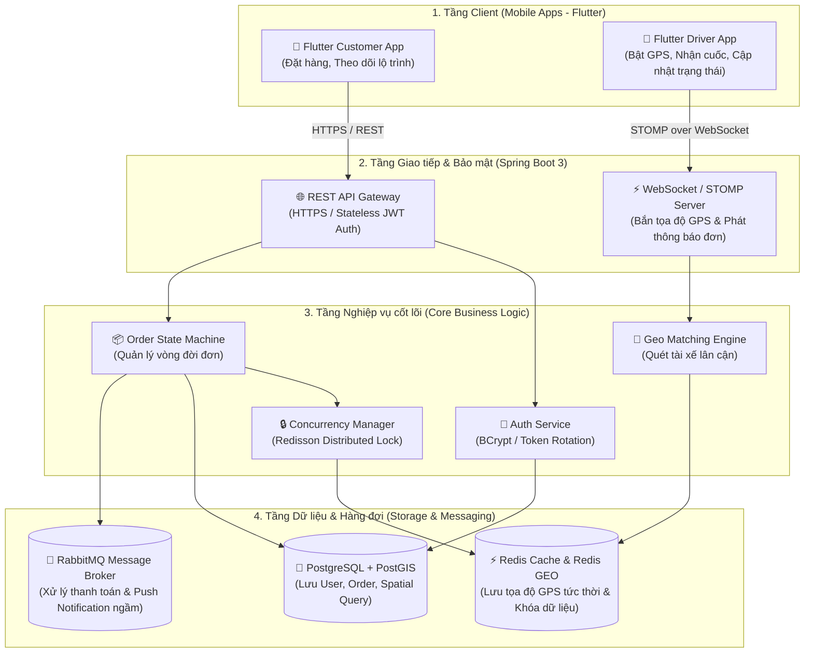
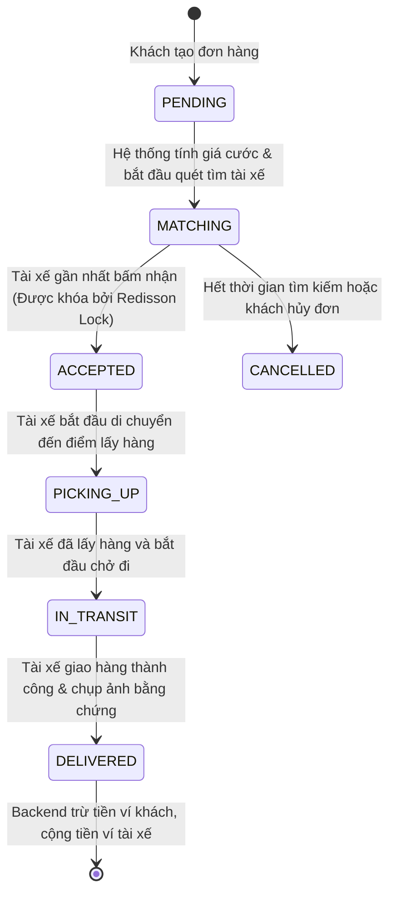

#  SwiftDrop – High-Level Architecture & Product Design

> **Tài liệu:** Bản thiết kế Kiến trúc Tổng quan (High-Level Design - HLD)  
> **Dự án:** SwiftDrop – Nền tảng Giao vận & Điều phối Nội thành Thời gian thực  
> **Tác giả:** Pham Viet Quang Huy  
> **Ngày tạo:** 2026-08-27  

---

## 1. Tuyên ngôn Sản phẩm & Bài toán Giải quyết (Product Vision)

SwiftDrop là nền tảng công nghệ kết nối giữa **Người gửi hàng (Customer)** và **Tài xế giao hàng (Driver)**:
* **Vấn đề giải quyết:** Tối ưu hóa thời gian giao hàng tức thì trong nội thành; tính cước tự động dựa trên khoảng cách; theo dõi hành trình trực tiếp của tài xế trên bản đồ.
* **Đối tượng phục vụ:**
  1. *Khách hàng (Customer):* Cần gửi đồ nhanh, theo dõi vị trí xe thời gian thực.
  2. *Tài xế (Driver):* Nhận đơn quanh khu vực đang đứng, nhận tiền cước tức thì vào ví.
  3. *Hệ thống (Backend Engine):* Tự động điều phối, ghép nối tài xế gần nhất trong bán kính 3km và chống tranh chấp đơn hàng.

---

## 2. Kiến trúc Hệ thống Tổng quan (System Architecture)

Hệ thống được thiết kế theo kiến trúc **Modular Monolith** phân tầng rõ ràng:

---

## 3. Vòng đời Trạng thái Vận đơn (Order State Machine)

Toàn bộ quy trình từ lúc khách bấm đặt đơn đến khi giao hàng thành công:

---

## 4. Lộ trình Triển khai Dự án (Engineering Roadmap)

* **Chặng 1: Xác thực & Quản lý Người dùng (Authentication & User Management)**
  * Thiết kế Entity `User`, bảng `users`, mã hóa mật khẩu `BCrypt`.
  * Cấp phát thẻ bài xác thực `JWT` (Access Token / Refresh Token).
* **Chặng 2: Quản lý Vận đơn & Tính cước (Order Management & Pricing Engine)**
  * Thiết kế bảng `orders`, tích hợp thuật toán tính khoảng cách (Haversine / PostGIS).
  * Xây dựng luồng chuyển đổi trạng thái đơn hàng theo State Machine.
* **Chặng 3: Không gian Địa lý & Thời gian thực (Real-time Geo Tracking)**
  * Tích hợp `Redis GEO` lưu vết tọa độ tài xế.
  * Tích hợp `WebSocket (STOMP)` phát đơn hàng tức thời.
  * Cài đặt `Redisson Distributed Lock` chống 2 tài xế nhận cùng 1 đơn.
  * Ứng dụng Flutter hiển thị Google Maps và vẽ xe di chuyển mượt mà.
* **Chặng 4: Tự động hóa Bất đồng bộ & Hoàn thiện (Async Events & Polish)**
  * Tích hợp `RabbitMQ` gửi thông báo đẩy (Push Notification) và xử lý ví tiền.
  * Cơ chế ngoại tuyến `Offline-First` cho app tài xế.v# 🚀 SwiftDrop – High-Level Architecture & Product Design

> **Tài liệu:** Bản thiết kế Kiến trúc Tổng quan (High-Level Design - HLD)  
> **Dự án:** SwiftDrop – Nền tảng Giao vận & Điều phối Nội thành Thời gian thực  
> **Tác giả:** Pham Viet Quang Huy  
> **Ngày tạo:** 2026-08-27  

---

