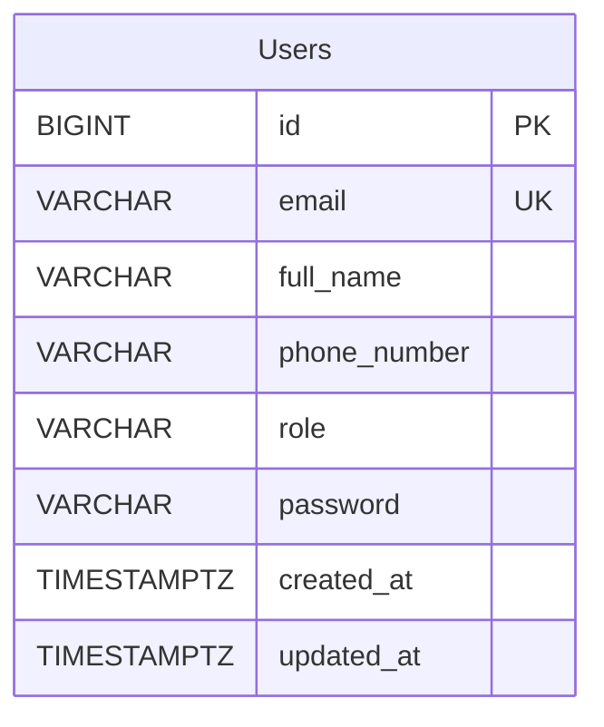

# Auth-desgin

## 1. Database ERD and Schema



### Data Dictionary: Bảng `users`

| Tên cột        | Kiểu dữ liệu   | Ràng buộc               | Mô tả                                                 |
| :------------- | :------------- | :---------------------- | :---------------------------------------------------- |
| `id`           | `BIGINT`       | PRIMARY KEY             | Khóa chính định danh người dùng                       |
| `email`        | `VARCHAR(100)` | NOT NULL, UNIQUE        | Email đăng nhập                                       |
| `full_name`    | `VARCHAR(100)` | NOT_NULL                | Họ và tên                                             |
| `phone_number` | `VARCHAR(20)`  | NOT_NULL                | Số điện thoại                                         |
| `role`         | `VARCHAR(20)`  | NOT_NULL                | Vai trò: `ROLE_CUSTOMER`, `ROLE_DRIVER`, `ROLE_ADMIN` |
| `password`     | `VARCHAR(60)`  | NOT_NULL                | Mật khẩu tài khoản                                    |
| `created_at`   | `TIMESTAMPTZ`  | NOT_NULL, DEFAULT NOW() | Thời gian tạo tài khoản                               |
| `updated_at`   | `TIMESTAMPTZ`  | NULL                    | Thời gian cập nhật                                    |

## API constract

[HTTP Method] /api/v1/[tên-tài-nguyên-số-nhiều]/[hành-động-hoặc-id]

- **EndPoint:** `POST /api/v1/auth/register`

* **Content type:** application/json

### Request payload(From mobile)

```json
{
  "email": "user@gmail.com",
  "fullname": "user name",
  "password": "abcd123",
  "phonenumber": "012345678"
}
```
